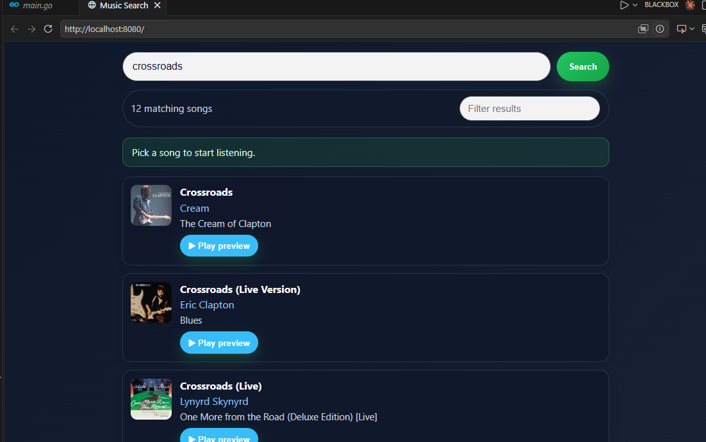

# iTunes Search CLI / App

A lightweight, fast media search tool built in Go that interfaces with Apple's public iTunes Search API. Built to explore Go's concurrency, strict typing, and zero-dependency compilation.



## Features

- **Instant Search:** Query track, album, and artist metadata directly from the command line / app interface.
- **Fast Parsing:** Statically typed JSON unmarshaling mapped to Apple's API schema.
- **Concurrent Requests:** Handles metadata and artwork payload fetches using goroutines.
- **Zero External Dependencies:** Built leveraging Go's standard library (`net/http`, `encoding/json`).
- **Single Binary:** Cross-compiles into a standalone executable.

## Tech Stack

- **Language:** Go (1.2x+)
- **API:** Apple iTunes Search API
- **UI / Library:** [e.g., Standard Library / Bubbletea / Fyne]

## Architecture & Code Highlights
├── Song         
├── client
│  
├── server
│   └── main.go       # Struct definitions matching iTunes JSON schema
                      # HTTP client, endpoint queries, and payload parsing
└── README.md


### JSON Response Mapping
The iTunes API returns mixed-type, optional fields. Go's strict struct tagging ensures predictable memory layout and safe fallback handling:

```go
type Track struct {
	TrackName     string `json:"trackName"`
	ArtistName    string `json:"artistName"`
	PreviewURL    string `json:"previewUrl"`
	ArtworkURL100 string `json:"artworkUrl100"`
	TrackViewURL  string `json:"trackViewUrl"`
	CollectionName string `json:"collectionName"`
}
```
Quick Start
Prerequisites
Go 1.20 or higher installed.

Installation & Run
Clone the repository:

Bash
git clone [https://github.com/Null-source404/GO--] (https://github.com/Null-source404/GO--.git)
cd Song
Run directly:

Bash
go run main.go
Build executable binary:

Bash
go build -o itunes-search main.go
./itunes-search
License
MIT
