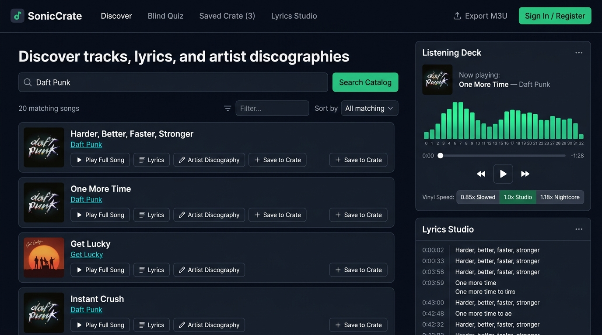

# iTunes Search CLI / App (SonicCrate)

A lightweight, fast media search and music discovery studio built in Go that interfaces with Apple's public iTunes Search API, Apple's Top Songs RSS Chart, and LRCLIB's synced lyrics catalog. Built to explore Go's concurrency (`sync.WaitGroup` goroutines), strict typing, session authentication, and zero-dependency compilation.



## Features

- **Compact, Low-Scroll Studio Interface:**
  - **Spacious Search Bar & Search Categories:** Full-width search input paired with a dedicated row of generously sized **Search Categories** buttons (`Daft Punk`, `The Weeknd`, `Tame Impala`, `Fleetwood Mac`, `Lo-Fi & Jazz`, `Hip-Hop`, `Weekly Picks →`) that never clip or overflow text.
  - **2-Column Grid & Ultra-Compact Rows (`2-Col Grid` / `Compact Rows`):** Search results, weekly recommendations, and crate tracks render in a high-density 2-column studio grid (or single-line compact rows) inside a viewport-bounded scroll pane so you can scan dozens of songs without endless page scrolling.
  - **Side-by-Side Split Lyrics Reader:** Clicking **Lyrics** on any song in **Discover** opens an in-place **Split Lyrics Reader** right alongside your search results so you can read lyrics and browse tracks simultaneously.
  - **2-Column Sheet-Music Lyrics Studio:** The pinned **Lyrics Studio** tab formats lyrics in a 2-column sheet layout (`2-Col Sheet (Less Scroll)` / `1-Col Synced`) with an instant verse/line filter input, live playback line highlighting, and click-to-seek LRC timestamps.
- **Weekly Recommendations (`/recommendations` — User Activity + Weekly Global Hits):**
  - **Based on Your Activity (`For You`):** Tracks your searches, recently played songs, artist deep-dives, and saved crate genres to concurrently fetch personalized weekly song recommendations with clear match reasons (e.g., *"Based on your activity with Daft Punk"*, *"Matched to your Electronic listening sessions"*), automatically excluding songs you've already played this session.
  - **Weekly Global Hits (`Weekly Hits`):** Concurrently fetches this week's top charting songs from Apple's iTunes Top Songs feed (`Weekly Global Chart #1`, `#2`, etc.) so you can stream current global hits alongside your personal radar.
- **Tiered Playback & Firebase Email Authentication (Graceful Guest 30s Previews vs. Registered Full Songs):**
  - **Guest Mode with Studio Fade-In / Fade-Out Envelope (Before Login):** Play 30-second iTunes audio previews immediately without an account. Because raw iTunes 30s clips are cut directly from the middle of a song, the player applies a **2.0-second S-curve studio fade-in** (`startGracefulFadeIn` + Web Audio `GainNode`), a **650ms resume ramp**, a **220ms smooth pause fade**, and a **2.4-second end-of-clip fade-out** so previews enter and exit gracefully instead of jumping in abruptly.
  - **Firebase Authentication & Email Acknowledgment Links (After Registration / Login):**
    - Register real user email addresses via **Firebase Authentication** (`createUserWithEmailAndPassword` + `sendEmailVerification` or **Google Sign-In** via `signInWithPopup`) synced with the Go backend (`/auth/firebase-sync`, `/auth/register`, `/auth/verify`) and **Cloud Firestore** (`/users/{userId}` and isolated PII subcollection `/users/{userId}/private/info`).
    - **Account Creation Acknowledgment Links:** Upon registration, Firebase dispatches a verification email link (`sendEmailVerification`) and the Go server generates an instant acknowledgment verification link (`/?verifyToken=<token>&email=<email>`) displayed in the **Verification Acknowledgment Banner** so users can acknowledge and verify their newly created account immediately.
    - **Personalized 'Welcome Back' Studio Greeting (`#memberWelcomeBanner`):** When signed in, the main workspace displays a dynamic **Welcome Back** banner with the user's monogram avatar, time-of-day greeting (`Welcome back, <Name>! · Good morning/afternoon/evening`), live session & crate stats (`last played track`, `saved crate count`, `session plays`), and one-click actions to **▶ Resume Last Track**, open **Your Weekly Picks →**, or jump to the **Saved Crate**.
    - **Full Studio Audio Stream & Official Full Song Video:** Unlocks complete, uninterrupted full-length song streaming powered by concurrent Go `oEmbed` verification (`/fulltrack`) and the YouTube IFrame Audio/Video Engine (`YT.Player`), with background pre-fetching on search and hover.
- **Top-of-Sidebar Recently Played Tracker (Last 10 Songs):** Positioned at the very top of the studio sidebar (and ordered above the track list on compact screens) so you can view and replay the last 10 songs from your current session (`0/10`) without scrolling down.
- **Studio Listening Deck & Vinyl Pitch Control:** Features a real-time 32-bar HTML5 Canvas frequency spectrum visualizer, interactive time scrubber, continuous auto-advance queue, and Vinyl Speed controls (`0.85x Slowed`, `1.0x Studio`, `1.18x Nightcore`).
- **Artist Discographies, Blind Audio Quiz & Saved Crate:** Explore full artist album discographies (`/artist`), test your music ear with a 4-option mystery audio trivia mode, bookmark favorite songs into a persistent crate, and export `.m3u` playlists.
- **Fast Parsing & Concurrent Requests:** Statically typed JSON unmarshaling and parallel payload fetching using Go's `sync.WaitGroup`, `context.WithTimeout`, and `sync.RWMutex`.
- **Zero External Dependencies:** Built purely on Go's standard library (`net/http`, `encoding/json`, `context`, `crypto/sha256`, `crypto/rand`, `sync`).
- **Single Binary:** Cross-compiles into a standalone executable with automatic static client directory resolution.

## Tech Stack

- **Language:** Go (1.20+)
- **APIs & Cloud Services:** Apple iTunes Search API, Apple iTunes Top Songs RSS Feed, LRCLIB Synced Lyrics API, Firebase Authentication (Email/Password Verification Links & Google Sign-In), Cloud Firestore, YouTube IFrame JS API & Concurrent Go `oEmbed` Verifier
- **UI / Library:** Go Standard Library (`net/http`) + HTML5 / CSS3 / Vanilla JS Studio Client (Web Audio API & Canvas Visualizer)

## Architecture & Code Highlights

```text
GO--/
├── Song/
│   ├── client/
│   │   ├── index.html               # Compact Studio UI, Verification Acknowledgment Banner,
│   │   │                            # Discover + Split Lyrics Drawer, Weekly Picks, 2-Col Lyrics Studio,
│   │   │                            # Firebase Auth Modal & "@2026 all rights reserved # Sonic_Crate.enjoy" footer
│   │   ├── index.css                # Viewport-fitted dark-slate styling, 2-col grid & 2-col lyric sheet
│   │   └── script.js                # Firebase Auth + Email Verification Links, Firestore profile sync,
│   │                                # Activity tracker, Weekly Radar, Studio Fade-In/Out & YT.Player engine
│   ├── server/
│   │   └── main.go                  # Go HTTP server, concurrent Search/Recommendations/Artist/Lyrics,
│   │                                # Firebase Auth sync (/auth/firebase-sync), Email Verification (/auth/verify),
│   │                                # and concurrent Full-Track resolver (/fulltrack)
│   ├── go.mod                       # Go module definition (zero external dependencies)
│   └── screenshot-2026-08-04.png    # Application interface preview
├── .env.example                     # Safe environment variable template (no real keys committed)
├── .gitignore                       # Excludes firebase-applet-config.json, .env*, keys, and users.json
├── firebase-blueprint.json          # Firestore schema blueprint (UserProfile & isolated UserPrivateInfo)
├── firestore.rules                  # Hardened Zero-Trust Firestore security rules
└── README.md
```

### Credential & Public Repository Security

- **Zero Exposed Secrets in Version Control:** All Firebase configuration files (`firebase-applet-config.json`, `**/firebase-applet-config.json`, `firebase_applet_config.xml`), `.env` files, service account keys, and local user session stores (`users.json`) are excluded via `.gitignore` and never stored in `Song/client/` or hardcoded in client HTML/JS files.
- **Environment Variable Support (`.env.example`):** Copy `.env.example` to `.env` (or export `FIREBASE_API_KEY`, `FIREBASE_PROJECT_ID`, `FIREBASE_AUTH_DOMAIN`, `FIREBASE_APP_ID`, `FIREBASE_FIRESTORE_DATABASE_ID`) to inject Firebase credentials at runtime via `/api/firebase-config`. If no Firebase credentials are provided in a public clone, the app automatically falls back to the Go server's built-in `/auth/register`, `/auth/login`, and `/auth/verify` flows without crashing.

### Server Endpoints (`Song/server/main.go`)

| Endpoint | Method | Auth | Description |
| :--- | :--- | :--- | :--- |
| `/search?q=<query>` | `GET` | Public | Queries iTunes Search API and normalizes track metadata + 600x600 artwork concurrently. |
| `/recommendations?artists=<a>&genres=<g>` | `GET` | Public | Uses parallel goroutines (`sync.WaitGroup`) to build personalized activity picks (`forYou`) and fetch Apple's Top Songs chart (`weeklyHits`). |
| `/artist?name=<artist>` | `GET` | Public | Uses 2 parallel goroutines to fetch top tracks and studio albums simultaneously. |
| `/lyrics?track=<t>&artist=<a>` | `GET` | Public | Fetches time-synced LRC and plain lyrics from LRCLIB. |
| `/auth/register` | `POST` | Public | Registers a new user (`name`, `email`, `password`), generates an email verification acknowledgment link (`/?verifyToken=...&email=...`), and returns a Bearer token. |
| `/auth/login` | `POST` | Public | Authenticates an existing user and returns a session Bearer token + verification status. |
| `/auth/firebase-sync` | `POST` | Public | Syncs a Firebase-authenticated user (`uid`, `name`, `email`, `emailVerified`) with the Go server session and returns a verification acknowledgment link if unverified. |
| `/auth/verify` | `GET` | Public | Verifies an email acknowledgment link (`?verifyToken=<t>&email=<e>`) to confirm account creation. |
| `/auth/me` & `/auth/logout` | `GET`/`POST` | Bearer | Validates or terminates the active user session. |
| `/api/firebase-config` | `GET` | Public | Serves runtime Firebase initialization config from environment variables (or local gitignored config) without committing credentials to version control. |
| `/fulltrack?track=<t>&artist=<a>` | `GET` | Bearer | Protected endpoint that concurrently verifies and caches embeddable full-length YouTube track IDs. |
| `/stream?track=<t>&artist=<a>` | `GET` | Bearer/Public | Same-origin audio stream proxy with range request support (`Accept-Ranges: bytes`) and fast `1.2s` upstream timeout. |

### JSON Response Mapping
The iTunes API returns mixed-type, optional fields. Go's strict struct tagging ensures predictable memory layout and safe fallback handling:

```go
type Track struct {
	TrackID          int64   `json:"trackId"`
	ArtistID         int64   `json:"artistId"`
	CollectionID     int64   `json:"collectionId"`
	TrackName        string  `json:"trackName"`
	ArtistName       string  `json:"artistName"`
	PreviewURL       string  `json:"previewUrl"`
	ArtworkURL100    string  `json:"artworkUrl100"`
	ArtworkURL600    string  `json:"artworkUrl600"`
	TrackViewURL     string  `json:"trackViewUrl"`
	CollectionName   string  `json:"collectionName"`
	PrimaryGenreName string  `json:"primaryGenreName,omitempty"`
	TrackTimeMillis  int64   `json:"trackTimeMillis,omitempty"`
	ReleaseDate      string  `json:"releaseDate,omitempty"`
	TrackPrice       float64 `json:"trackPrice,omitempty"`
	Currency         string  `json:"currency,omitempty"`
	RecReason        string  `json:"recReason,omitempty"`
}
```

## Quick Start

### Prerequisites
- Go 1.20 or higher installed.

### Installation & Run

1. **Clone the repository:**

```bash
git clone https://github.com/Null-source404/GO--.git
cd GO--/Song/server
```

2. **Run the web application directly:**

```bash
go run main.go
```

3. **Open the application in your browser:**
   - Visit **http://localhost:8080**
   - **Discover & Low-Scroll Modes:** Switch between **2-Col Grid** and **Compact Rows** to view more songs at once, or click **Lyrics** on any song in **Discover** to open the **Side-by-Side Split Lyrics Reader** right next to your search results.
   - **Weekly Picks:** Click **Weekly Picks** in the top navigation bar to explore songs tailored to your in-app activity (**Recommended For You**) alongside **Weekly Global Hits**.
   - **2-Column Lyrics Studio:** Open **Lyrics Studio** in the top bar to read lyrics in a 2-column sheet layout with instant line filtering and click-to-seek timestamps.
   - **Guest vs. Full-Song Member Mode:** Play 30-second previews as a guest, or click **Sign In / Register** to unlock complete full-length playback in both **Full Studio Audio Stream** and **Official Full Song Video** modes.

4. **(Optional) Query tracks directly from the command line:**

```bash
go run main.go -q "Daft Punk"
```

5. **Build a standalone executable binary:**

```bash
go build -o itunes-search main.go
./itunes-search
```

## License
MIT
